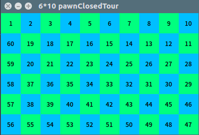
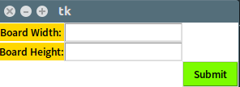

# ALGO_HW3

### 程式碼
* ```hw3_pawn_closedTour.py``` ----> 士兵的 Closed Tour
* ```hw3_pawn_opentour.py``` ---> 士兵的 Open Tour

### exe 執行檔
* ```hw3_pawn_closedTour.exe``` ---> 士兵的 Closed Tour
* ```hw3_pawn_opentour.exe``` ---> 士兵的 Open Tour

### 執行
#### 1.
* 直接執行 .exe 檔

#### 2.
* 開啟終端機 ```cd``` 到程式資料夾底下
* 輸入 ```python hw3_pawn_closedTour.py``` 或 ```python hw3_pawn_opentour.py```
* 出現程式視窗



### 回答
* #### Board width ---> 棋盤寬
* #### Board Height ---> 棋盤高
* #### 兩個都輸入完後按 ```Submit``` 提交

### 結果
* #### 會依照順序依序顯示其路徑結果
